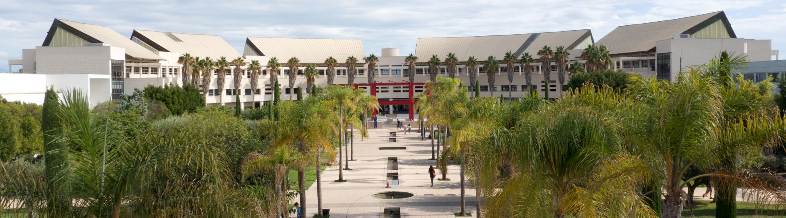

  

<h1 align="center">📸 Tech4Diet Research Lab 👀</h1>
<h3 align="center">🏛️ University of Alicante 🏛️</h3>

  <strong>
    Welcome to the official repository of the Tech4Diet Research Lab at the University of Alicante.  
    We focus on applied research in Artificial Intelligence, particularly in areas such as machine learning and computer vision.  
    This repository hosts resources, code, datasets, and documentation from our ongoing projects.
  </strong>

  
  
  
  

---

## 🚀 Active Projects

<h2 align="center"> 👩‍⚕️ Tech4Diet – AI for Nutrition 📷</h2>

  
  
  
   
  

  

<h2 align="center">🐟 GLORiA – Fish Origin Classification 🔎</h2>

  
   
  
  

<h2 align="center">🦈 e-Lasmobranc – Fish Species Detection and Classification 🌊</h2>

  
  
  
  

## 👥 Research Team

| Name | Role | GitHub | Contact |
|------|------|--------|---------|
| Dr. Andrés Fuster Guilló | Principal Investigator | – | fuster@ua.es |
| Dr. Jorge Azorín López | Principal Investigator | – | jazorin@ua.es |
| Dr. Marcelo Saval Calvo | Principal Investigator | – | m.saval@gcloud.ua.es |
| [Dr. Nahuel Emiliano Garcia d'Urso](https://github.com/nawue) | Principal Investigator | @nawue | nahuel.garcia@ua.es |
| [Bernabé Sanchez Sos](https://github.com/Bernabe19) | PhD Student | @Bernabe19 | bernabe.sanchez@ua.es |
| [Ismael Beviá Ballesteros](https://github.com/ibevias) | PhD Student | @ibevias | ismael.bevias@ua.es |
| [Mario Jerez Tallón](https://github.com/Mariojt72) | Research Assistant | @Mariojt72 | mario.jerez@ua.es |

---

<!-- Logos centered -->

  

